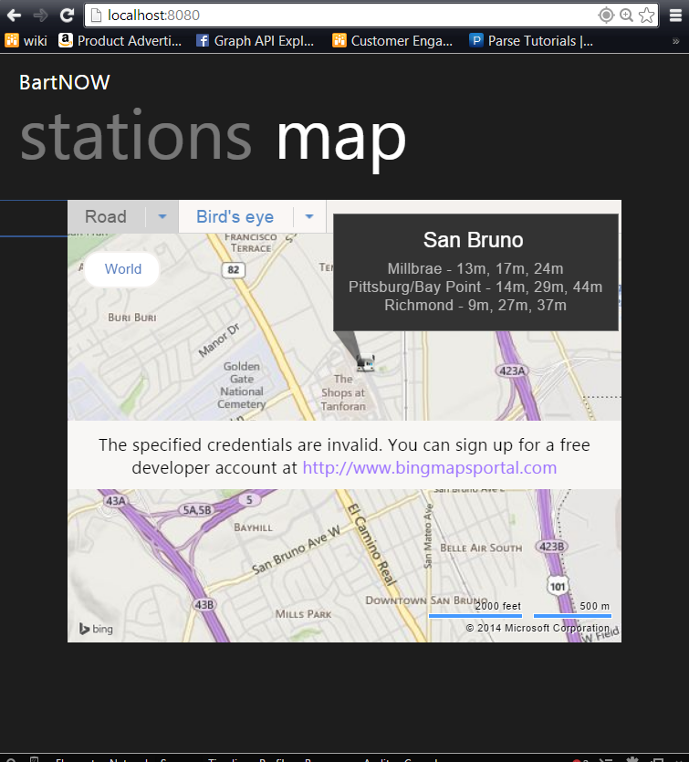
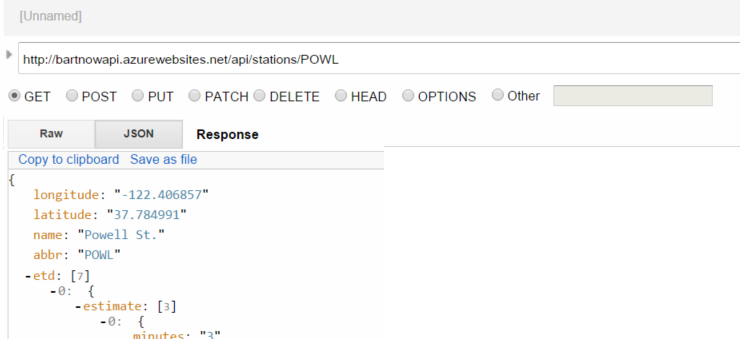
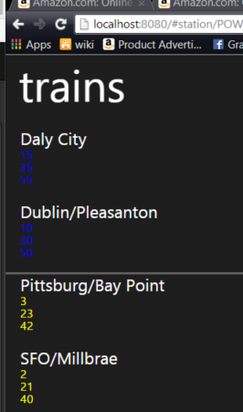
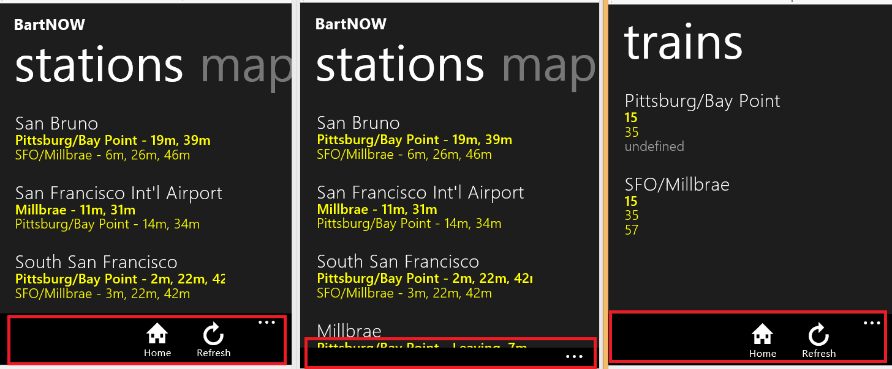

Building a Single Page Web App With WinJS + BackboneJS
==========

# Introduction

It’s not commonly known that WinJS was born out of the browser, and then went to Windows 8. Since then WinJS has been released for Windows 8.1, Xbox One and Windows Phone 8.1. 

In this talk, we’ll go over how WinJS provides developers with a distinctive set of high performance, polished UI controls and the cohesive set of components and infrastructure it provides for your HTML5 web apps.

# Objective

This lab will walk you through the creation of **[BartNOW](http://bartnow.azurewebsites.net)** a single page web application (SPA) which finds the nearest **[Bay Area Rapid Transit](http://bart.gov)** (BART) stations to you in the Bay Area.

The application uses the BART api to get the nearest BART stations to you and shows you the real-time estimates of upcoming train arrivals.

After the end of this lab you will know:

- How databinding is done in WinjS
- How organize your application in Winjs 'Pages', a collection of HTML, CSS and javascript
- How Backbone.js can be used to create hashbang routes

# Getting Setup

To get yourself ready for this lab you want to [**clone this repository**](http://github.com/sedouard/winjs-svcc) and host the **Start** folder with a web server of your choice. Afterwards browse to your web server and you'll just see a blank page:


It's dark because we are pulling the dark theme css file from Winjs.

Currently we have a skeleton of an application, it includes all of the require libraries, including **[jquery](http://jquery.com)** **[backbone](http://backbonejs.com)** and **[winjs](http://try.buildwinjs.com)**.

You may notice you'll be prompted to give your location. Go ahead and give the applciation permission.

# The Content Host Div

Fundamental to any single page application is that there is a main div in which all pages of the application are rendered. You can sort of think of the structure of the application like this:


Each content view we have, represented by a unit of HTML will be rendered into the contenthost div. This is why a single page application only has one page and keeps the application from 'blinking'.

In our **[index.html](End/index.html)** we will add to the body:

```html

<body>

	<!-- App body goes here -->
	
	<!-- Used to render each individual view -->
    <div id="contenthost" style="width:100%;height:100%"></div>

</body>
```

# Creating the Home View Model

Now that we have our contenthost div we need to programatically define our Home view with **[backbonejs](http://backbonejs.com)**. Open **[js/index.js](js/index.js)** and you'll notice we have some skeleton code:

```js

//globally redirect to our rest api
$.ajaxPrefilter( function(options, originalOptions, jqXHR){
    options.url = "http://bartnowapi.azurewebsites.net/api" + options.url;
});
var g_Location;
(function () {
    "use strict";
    var currentLocation = "/#";
    var app = WinJS.Application;
    var nav = WinJS.Navigation;
    var sched = WinJS.Utilities.Scheduler;
    var ui = WinJS.UI;

//MODELS

    //A Single station
    var Station = Backbone.Model.extend({
        urlRoot: '/stations'
    });

    //A collection of stations
    var Stations = Backbone.Collection.extend({
        url: '/stations'
    });

//VIEWS
    var HomeView = Backbone.View.extend({
        initialize: function(){
            this.render();
        },
        render: function(){

        }
    });

var StationView = Backbone.View.extend({
        initialize: function(){
            this.render();
        },
        render: function(){

        }
    });

//END VIEWS 

//ROUTES
    var AppRouter = Backbone.Router.extend({
        routes: {
            '*action': 'home'
        }
    });

//END ROUTES

//BEGIN WINJS INIT
    app.addEventListener("ready", function (args) {

        //We need the current location of device.
        //if we can't do it the app will just alert
        if(navigator.geolocation){
                navigator.geolocation.getCurrentPosition(function(position){

                    g_Location = position.coords;
                    
                    ui.processAll().then(function() {

                    }).then(function(){
                        return sched.requestDrain(sched.Priority.aboveNormal + 1);
                    }).then(function(){
                        ui.enableAnimations();

                        //Necessary for bookmarkable URLS
                        Backbone.history.start();
                    });
                }, function(error) {
                    alert(error);
                }
            );
        }
        else{
            alert('Could not get your location. BartNOW Requires your location to work');
        }
        
    });

})();


```

The current code has some boilerplate WinJS code which uses **Backbone.View.extend** to create a **StationsView** and **HomeView** as well as two models **Stations** and **Station**.

Lets focus on the **Station** model, since we need those first before we can actually render anything particularly interesting.

We first define the model with:

```js

//A collection of stations
var Station = Backbone.Model.extend({
    urlRoot: '/stations'
});

```

Take a look at the top of **index.js**The jQuery **ajaxPrefilter** method set globally will actually redirect all jQuery Ajax requests to the url defined in **options.url**:

```js
$.ajaxPrefilter( function(options, originalOptions, jqXHR){
    options.url = "http://bartnowapi.azurewebsites.net/api" + options.url;
});

```

So what's actually happening here is that Backbone will make a REST api request to **http://bartnowapi.azurewebsites.net/api/stations** and treat the output of JSON from the API as a collection of objects. Because **/api/stations** returns an array this works out perfectly.

Try doing a GET - **http://bartnowapi.azurewebsites.net/api/stations** with a REST tool like **[Advanced Rest Client](https://chrome.google.com/webstore/detail/advanced-rest-client/hgmloofddffdnphfgcellkdfbfbjeloo)** and see the output you get:


Notice how we get a json array of 44 items with data about the station. It's this data that will back the backbone model.


## Creating the Home View

The main view of the application will be the **HomeView**. The starter code in **[js/index.js](js/index.js)** gives you the following starter code:


```js

var HomeView = Backbone.View.extend({
    initialize: function(){
        this.render();
    },
    render: function(){

    }
});

```

This specifies a render function which is where we will tell backbone how to render this view. this is where WinJS comes in. We first use **WinJS.UI.Pages.get** to retrieve the WinJS page object. This object represents the collection of javascript, html and css which makes up the view:

```js

var HomeView = Backbone.View.extend({
    initialize: function(){
        this.render();
    },
    render: function(){
        var that = this;
        
        var HomePage = WinJS.UI.Pages.get('/pages/home/home.html');

    }
});

```

Now to load the data for the **Stations** model, we need to create a new instance of the model and use the **fetch** function to grab the data from our backend api:


```js

var HomePage = WinJS.UI.Pages.get('/pages/home/home.html');

//Load up stations from server

var HomeView = Backbone.View.extend({
    initialize: function(){
        this.render();
    },
    render: function(){
        var that = this;
        
        var HomePage = WinJS.UI.Pages.get('/pages/home/home.html');

        //Load up stations from server

        var stations = new Stations();

        stations.fetch({
            data: g_Location,
            success: function(){
                
            }
        });
        

        var hp = new HomePage(that.el, stations);
        hp.element.style.width = "100%";
        hp.element.style.height = "100%";

        return this;
    }
});


```

Now that we have our entire view, we need to create a **Backbone.Router** router that will be responsible for creating our front-end routes for the app. The starter code in **[js/index.js](js/index.js)** starts you off with


```js
//END VIEWS 

//ROUTES
var AppRouter = Backbone.Router.extend({
    routes: {
        '*action': 'home'
    }
});


```

This creates one route handler for any route and render a view we will call **home**. We can register an event when the browser hits this route by using the **router.on** function:

```js
//END VIEWS 

//ROUTES
var AppRouter = Backbone.Router.extend({
    routes: {
        '*action': 'home'
    }
});

//create the router
var router = new AppRouter();

//create the event handler for the router
router.on('route:home', function(){
	//create a new home view and place it into the contenthost
    var home_view = new HomeView({ el: $("#contenthost") });
});

```

Now run the website and take a look at the console:


This message comes from the page code in **pages/home/home.js**. Now our app has a default route which will render the home view.

The Home view renders but it doesn't display anything. This is because we need to create the WinJS HTML elements as well as the databinding code to bring those elements to life.

 # Rendering the Home View

In the **pages/home** folder, we have three files **home.css** **home.js** and **home.html**. A good practice with Winjs is to consider a WinJS Page object as a collection of these three things. Let's take a look at the starter code in **[pages/home/home.js](pages/home/home.js)**:


```js

(function () {
    "use strict";

    var sched = WinJS.Utilities.Scheduler;
    var ui = WinJS.UI;
    var app = WinJS.Application;
    var map;

    window.Stations = new WinJS.Binding.List([]);

   
    WinJS.UI.Pages.define("/pages/home/home.html", {
        init: function(){
            
        },
        ready:function(element, stations){

            console.log('home page loaded!');
            //Define Home page here

            
        }
    });

    
})();


```

The **WinJS.UI.Pages.define** allows us to create the logical page in which WinJS uses to oraganize its views. You a variety of handlers after defining the page. In this case explicitly call out the **init** and **ready** functions. A few more handlers exist but I find they are more useful for native applications.


What you will notice thats most important here is that we have **window.Stations** which is a WinJS bindable collection. This contents of this list will allow the UI to bind to the data in these elements.

Because we pass the **HomePage** constructor a **Stations** model collection, we have that available when the page is loade up:

```js

WinJS.UI.Pages.define("/pages/home/home.html", {
    init: function(){
        
    },
    ready:function(element, stations){
		//clear out any stale station data in the bindable list
        if(window.Stations){
            window.Stations.forEach(function(){
                window.Stations.pop();
            });
        }
		//fill the list up with the new data
        for(var i in stations.models){
            addStationToList(stations.models[i]);
        }
    }
    
    //in case the data comes after this page is loaded, push it into the view model

    stations.on("add", function(model){
        addStationToList(model);
        addStationToMap(model);
    });
});

```

The function **addStationToList** simply does some management on ensuring that the data going into the model has at least 3 arrival times for UI display purposes. It ends up pushing the model to bindable list **window.Stations**.

Now that we have all of our data in the **window.Stations** object, we can access it from the UI. The UI for this application uses the **[Pivot](http://try.buildwinjs.com/#pivot)** control. First lets take a look at what we were already provided in **home.html**:

```html

<!DOCTYPE html PUBLIC "-//W3C//DTD XHTML 1.0 Transitional//EN" "http://www.w3.org/TR/xhtml1/DTD/xhtml1-transitional.dtd">
<head>
    <meta http-equiv="Content-Type" content="text/html; charset=utf-8"/>
    <meta name="viewport" content="width=device-width, initial-scale=1.0, maximum-scale=1.0, user-scalable=no"/>
    <title>BartNOW</title>

    <link href="/pages/home/home.css" rel="stylesheet"/>
    <script src="/pages/home/home.js"></script>
</script>
</script>
</head>
<body>

<!-- Home Pivot, List View and Template goes here -->

</body>

```

As the comment suggests, we need a **Pivot**, **List View** and **Template**. Lets start with the Pivot as its the main control for the page. Every WinJS UI control is a **div** with a specific **data-win-control** tag which tells WinJS what kind of control it is and **data.win.options** to set certain options for that control. This is 100% cross platform compatible. Let's add the pivot:


```HTML
<!DOCTYPE html PUBLIC "-//W3C//DTD XHTML 1.0 Transitional//EN" "http://www.w3.org/TR/xhtml1/DTD/xhtml1-transitional.dtd">
<head>
    <meta http-equiv="Content-Type" content="text/html; charset=utf-8"/>
    <meta name="viewport" content="width=device-width, initial-scale=1.0, maximum-scale=1.0, user-scalable=no"/>
    <title>BartNOW</title>

    <link href="/pages/home/home.css" rel="stylesheet"/>
    <script src="/pages/home/home.js"></script>
</script>
</script>
</head>
<body>

<div id="homePivot" data-win-control="WinJS.UI.Pivot" data-win-options="{ title: 'BartNOW', selectedIndex: 0 }" style=".win-pivot-headers{ font-size: 400% }">
</div>


</div>
<!-- Home Pivot, List View and Template goes here -->

</body>


```

Notice how this is a regular old div except the data-win-control tag specifies the UI control class that represents this control, in this case **WinJS.UI.Pivot**. A Pivot control really isn't much unless you have a WinJS.UI.PivotItems inside it. Lets add a couple:

```html

<!DOCTYPE html PUBLIC "-//W3C//DTD XHTML 1.0 Transitional//EN" "http://www.w3.org/TR/xhtml1/DTD/xhtml1-transitional.dtd">
<head>
    <meta http-equiv="Content-Type" content="text/html; charset=utf-8"/>
    <meta name="viewport" content="width=device-width, initial-scale=1.0, maximum-scale=1.0, user-scalable=no"/>
    <title>BartNOW</title>

    <link href="/pages/home/home.css" rel="stylesheet"/>
    <script src="/pages/home/home.js"></script>
</script>
</script>
</head>
<body>

<div id="homePivot" data-win-control="WinJS.UI.Pivot" data-win-options="{ title: 'BartNOW', selectedIndex: 0 }" style=".win-pivot-headers{ font-size: 400% }">

	<div  class="listviewpivotitem" data-win-control="WinJS.UI.PivotItem" data-win-options="{ 'header': 'stations', managedLV: true }">
        
    </div>
    <div class="listviewpivotitem" data-win-control="WinJS.UI.PivotItem" data-win-options="{ 'header': 'map', managedLV: true }" style="text-align:center">
	</div>

</div>
<!-- Home Pivot, List View and Template goes here -->

</body>

```

You can see that now we have two titles which represent the two PivotItems we've added:


Now within those PivotItems we need to add something that will occupy those items as they switch.

We'll add a **WinJS.UI.LitView** and a Bing map object to the **stations** and **map** tabs:

```HTML

<!DOCTYPE html PUBLIC "-//W3C//DTD XHTML 1.0 Transitional//EN" "http://www.w3.org/TR/xhtml1/DTD/xhtml1-transitional.dtd">
<head>
    <meta http-equiv="Content-Type" content="text/html; charset=utf-8"/>
    <meta name="viewport" content="width=device-width, initial-scale=1.0, maximum-scale=1.0, user-scalable=no"/>
    <title>BartNOW</title>

    <link href="/pages/home/home.css" rel="stylesheet"/>
    <script src="/pages/home/home.js"></script>
</script>
</script>
</head>
<body>

<div id="homePivot" data-win-control="WinJS.UI.Pivot" data-win-options="{ title: 'BartNOW', selectedIndex: 0 }" style=".win-pivot-headers{ font-size: 400% }">

    <div  class="listviewpivotitem" data-win-control="WinJS.UI.PivotItem" data-win-options="{ 'header': 'stations', managedLV: true }">
        <div id="homePivotListView" data-win-control="WinJS.UI.ListView" data-win-options="{ itemDataSource: Stations.dataSource, layout: { type: WinJS.UI.ListLayout }, itemTemplate: stationTemplate, selectionMode: 'none' }"></div>
    </div>
    <div class="listviewpivotitem" data-win-control="WinJS.UI.PivotItem" data-win-options="{ 'header': 'map', managedLV: true }" style="text-align:center">
        <div id='mapDiv' style="position:relative; left:10%; width:80%; height:80%;"></div>
    </div>

</div>
<!-- Home Pivot, List View and Template goes here -->

</body>

```

Notice that in the div with the type **WinJS.UI.ListView**, we specify an **itemTemplate** option. This template allows us to template what an individual list item looks like provided the **itemDataSource** specified.

This template is written to bind to any object in the bindable list, **window.Stations**. Lets add the HTML which specifies what each one of our list view items will look like:

```HTML

<body>

    <div id="stationTemplate" data-win-control="WinJS.Binding.Template">
        <div class="mailItem">
            <div class="hitTarget win-interactive"></div>
            <div class="authorRoot">
                <h2 class="author" data-win-bind="innerHTML: attributes.name"></h2>
            </div>
            <h5 class="title win-pivot-slide1" data-win-bind="innerHTML: attributes.etd[0].formattedArrivals; style.color: attributes.etd[0].estimate[0].color"></h5>
            <h5 class="previewText win-pivot-slide2" data-win-bind="innerHTML: attributes.etd[1].formattedArrivals; style.color: attributes.etd[1].estimate[0].color"></h5>
            <h5 class="previewText2  win-pivot-slide3" data-win-bind="innerHTML: attributes.etd[2].formattedArrivals; style.color: attributes.etd[2].estimate[0].color"></h5>
        </div>
    </div>

    <div id="homePivot" data-win-control="WinJS.UI.Pivot" data-win-options="{ title: 'BartNOW', selectedIndex: 0 }" style=".win-pivot-headers{ font-size: 400% }">

        <div  class="listviewpivotitem" data-win-control="WinJS.UI.PivotItem" data-win-options="{ 'header': 'stations', managedLV: true }">
            <div id="homePivotListView" data-win-control="WinJS.UI.ListView" data-win-options="{ itemDataSource: Stations.dataSource, layout: { type: WinJS.UI.ListLayout }, itemTemplate: stationTemplate, selectionMode: 'none' }"></div>
        </div>
        <div class="listviewpivotitem" data-win-control="WinJS.UI.PivotItem" data-win-options="{ 'header': 'map', managedLV: true }" style="text-align:center">
            <div id='mapDiv' style="position:relative; left:10%; width:80%; height:80%;"></div>
        </div>

    </div>
    <!-- Home Pivot, List View and Template goes here -->

</body>


```

Notice how the templae is just a plain old div but has the type **WinJS.Binding.Template** this tells WinJS taht this isnt' a div to be literally displayed, rather it should be used for templating mutliple elements. The data context that the template is working in is **Stations.datasource** because that's waht set as **itemDataSource** for the **listviewpivotitem** div. Notice the **data-win.bind** attributes, this specifies where the data will come from for each element. When WinJS starts, it will use this to place the data from the data source to view. In our case the **attributes** field is where all the data for the stations that came from the REST api lives.

Now when you load up your page you should see the data coming and being rendered to the screen:


Our second PivotItem should contain a map for the user to see the stations. The starter code contains a function, **addStationToMap**. We won't go over the details of the map here but you can read more **[here](http://msdn.microsoft.com/en-us/library/gg427610.aspx)** about how to integrate the Maps control. Add the following code to your **ready** function for the Home view:

```js

ready:function(element, stations){
            //clear out any stale station data in the bindable list
            console.log('ready-' + stations);
            if(window.Stations){
                window.Stations.forEach(function(){
                    window.Stations.pop();
                });
            }
            //fill the list up with the new data
            for(var i in stations.models){
                console.log('added');
                addStationToList(stations.models[i]);
            }
			
	    //load map
            Microsoft.Maps.loadModule('Microsoft.Maps.Themes.BingTheme', { callback: function(){     

                    var currentLoc = new Microsoft.Maps.Location(g_Location.latitude, g_Location.longitude);

                    map = new Microsoft.Maps.Map(document.getElementById("mapDiv"), 
                                {
                                    credentials:"AqKaHOhFANG1MfClHVrtzvqfb_IuYutvB6NgNcsgMW5Ee_EpPd3a5q-uOUt3Mr0m",
                                    center: currentLoc,
                                    mapTypeId: Microsoft.Maps.MapTypeId.road,
                                    theme: new Microsoft.Maps.Themes.BingTheme(),
                                    zoom: 14
                                }
                            );
                    
                    var myPin = new Microsoft.Maps.Pushpin(currentLoc);

                    map.entities.push(myPin);

                    for(var i in stations.models){
                        addStationToMap(stations.models[i]);
                    }
                }
            });
			
	    //The data may not come in by the time this function is executing. Put an event handler
	    //whenever we get new data
            stations.on("add", function(model){

                
                addStationToList(model);
                addStationToMap(model);
                        


                
            });
        }
    });

```

The code above will create a map and add pushpins with the BART logo on the map. Each pin has a balloon when clicked and the upcoming departures for that station. After you add the code above to your ready function you should now see a map coming up. You have to register for a Maps API key in order to get rid of the pesky bar on the screen:




# Creating the Station View

We've created the Home view now lets add a view to expand data for a particular station. The BART API we will use has individual routes for each station. We can see this if we do a **GET - http://bartnowapi.azurewebsites.net/api/stations/POWL** (POWL is the station ID for Powell St Station):




You'll get a JSON schema from response body for the **Powell** station similar to below:

```json
{  
   "longitude":"-122.406857",
   "latitude":"37.784991",
   "name":"Powell St.",
   "abbr":"POWL",
   "etd":[  
      {  
         "estimate":[  
            {  
               "minutes":"3",
               "color":"BLUE",
               "hexColor":"#0099cc"
            },
            {  
               "minutes":"14",
               "color":"GREEN",
               "hexColor":"#339933"
            },
            {  
               "minutes":"18",
               "color":"BLUE",
               "hexColor":"#0099cc"
            }
         ],
         "formattedArrivals":"Daly City - 3m, 14m, 18m ",
         "destination":[  
            "Daly City"
         ],
         "abbr":[  
            "DALY"
         ]
      },
      {  
         "estimate":[  
            {  
               "minutes":"8",
               "color":"BLUE",
               "hexColor":"#0099cc"
            },
            {  
               "minutes":"23",
               "color":"BLUE",
               "hexColor":"#0099cc"
            },
            {  
               "minutes":"38",
               "color":"BLUE",
               "hexColor":"#0099cc"
            }
         ],
         "formattedArrivals":"Dublin/Pleasanton - 8m, 23m, 38m ",
         "destination":[  
            "Dublin/Pleasanton"
         ],
         "abbr":[  
            "DUBL"
         ]
      }
   ]
}

```


Lets start by creating a **station** model in our **js/index.js**:

```js
//MODELS

    //A Single station
    var Station = Backbone.Model.extend({
        urlRoot: '/stations'
    });
    
    //A collection of stations
    var Stations = Backbone.Collection.extend({
        url: '/stations'
    });

//VIEWS

```

Although this appears to hit the same route as the Stations model collection, we will append an **:id** to the url which retrieve just one station. :id will be the station abbreviation. Adding the **Station Route** shows this a bit more clearly:

```js

//ROUTES
    var AppRouter = Backbone.Router.extend({
        routes: {
            '': 'home',
            //:id will the station abbrevation
            'station/:id': 'station'
        }
    });

    //create the router
    var router = new AppRouter();

    //create the event handlers for the router
    router.on('route:home', function(){
        //create a new home view and place it into the contenthost
        var home_view = new HomeView({ el: $("#contenthost") });
    });

    router.on('route:station', function(id){
        $("#progressSymbol").show();
        console.log('Station route hit');
        currentLocation = "/#/station/" + id;
        var home_view = new StationView({ el: $("#contenthost"), id: id });
    });

//END ROUTES

```

Finally we need to implement the Station Backbone View:

```js

var StationView = Backbone.View.extend({
        initialize: function(){
            this.render();
        },
        render: function(){
            var that = this;
            
            var StationPage = WinJS.UI.Pages.get('/pages/station/station.html');

            //Load up stations from server

            var station = new Station({
                id: this.id
            });

            station.fetch({
                success: function(){

                    //show pivot view for this station
					///render this view after we've loaded the data since the user already has
					//useful data in front of them
                    that.$el[0].innerHTML ="";
                    var hp = new StationPage(that.el, station);
                    hp.element.style.width = "100%";
                    hp.element.style.height = "100%";
                    
                }
            });
            
            
            

            return this;
        }
    });

```

This is very similar to the Home view. Now that we have the WinJS view hooked up to Backbone, we need to add the WinJS databinding and pivots views to that station WinJS view. Let's take a look at what we already have in pages/station/station.js:

```js
(function () {
    "use strict";

    var sched = WinJS.Utilities.Scheduler;
    var ui = WinJS.UI;
    var app = WinJS.Application;
    
    WinJS.UI.Pages.define("/pages/station/station.html", {
        ready:function(element, station){

            //define your page here
        }
    });

    
})();

```

Just like before we are given the starter code for defining the **WinJS.UI.Page**. Now we need to add the data to the bindable list:

```js

(function () {
    "use strict";

    var sched = WinJS.Utilities.Scheduler;
    var ui = WinJS.UI;
    var app = WinJS.Application;
    
    WinJS.UI.Pages.define("/pages/station/station.html", {
        ready:function(element, station){

            var stationData = new WinJS.Binding.List(station.attributes.etd);
            window.StationName = station.attributes.name;
            //Another way we can declare bindable data is by creating a WinJS.Namespace
            WinJS.Namespace.define('BartNow.Station', {
                stationData : stationData,
                name : station.attributes.name
            });

            //define your page here
        }
    });

    
})();


```

Now let's add the **Pivot**, **PivotItem** and the **ListView** UI elements to the Station view HTML


```HTML
<!-- Start PIVOT... -->
<div id="stationTemplate" data-win-control="WinJS.Binding.Template">
    <div class="mailItem">
        <div class="hitTarget win-interactive"></div>
        <div class="authorRoot">
            <h2 class="author" data-win-bind="innerHTML: destination"></h2>
        </div>
        <h5 class="title win-pivot-slide1" data-win-bind="innerHTML: estimate[0].minutes; style.color: estimate[0].color"></h5>
        <h5 class="previewText win-pivot-slide2" data-win-bind="innerHTML: estimate[1].minutes; style.color: estimate[1].color"></h5>
        <h5 class="previewText2  win-pivot-slide3" data-win-bind="innerHTML: estimate[2].minutes; style.color: estimate[2].color"></h5>
    </div>
</div>

<div id="pivotScenario3" data-win-control="WinJS.UI.Pivot">
    <div class="listviewpivotitem" data-win-control="WinJS.UI.PivotItem" data-win-options="{ 'header': 'trains', managedLV: true }">
        
        <div data-win-control="WinJS.UI.ListView" data-win-options="{ itemDataSource: BartNow.Station.stationData.dataSource, layout: { type: WinJS.UI.ListLayout }, itemTemplate: stationTemplate, selectionMode: 'none' }"></div>
    </div>
    <div class="listviewpivotitem" data-win-control="WinJS.UI.PivotItem" data-win-options="{ 'header': 'schedule', managedLV: true }">
    </div>
</div>

```

Note how we are binding to **BartNow.Station** now instaed of **window.Stations**. In larger applications it may make sens to organize bindable data with WinJS.Binding.Namespace's instead of just using hte global window object.


Now navigate to **/#station/POWL** you'll see the rendered view of the Powell St. Station departure times:



# Linking the Home View with the Station View

To finish the basic user experience, we should navigate to the Station view whenever the user taps on the list view items. WinJS offers programmatic access and you can use jQuery to query the DOM for them. Lets add an event listener **iteminvoked** in **pages/home/home.js** which will respond to any click or tap events on the list item:

```js
//add click handler to the list view items
var thatStations = stations;
var listView = $("#homePivotListView")[0];
if(listView){
    listView.addEventListener("iteminvoked", function (evt) {
    var index = evt.detail.itemIndex;
		//navigate to the Station route with the :id being the station abbreviation
        window.location = '#/station/' + thatStations.models[index].attributes.abbr;

    });
}
```

The great part about using **[BackboneJS Routes](http://backbonejs.org/#Router-routes)** is that we can navigate to those urls, triggering our Router to take care of the navigation between views.

# Adding an App Bar

The last thing we should do is add an App Bar in order to allow the user to return back to home (instead of having to use the back button). This brings a true 'App' experience.

Recall back to our description of **[index.html](End/index.html)** as the Layout template and the contenthost div displaying each page within the same page. Whenever we want to place something in view which is consistent across each view, we should put it directly in index.html so that it remains there during the entire life of the application.

Let's add the App Bar HTML to index.html


```HTML
<div id="navBar" data-win-control="WinJS.UI.AppBar" data-win-options="{ placement: 'bottom'}">
    <button id="homeButton" data-win-control="WinJS.UI.AppBarCommand" data-win-options="{id:'cmdAdd',label:'Home',icon:'home',section:'global',tooltip:'Home'}"></button>
    <button id="refreshButton" data-win-control="WinJS.UI.AppBarCommand" data-win-options="{id:'cmdRemove',label:'Refresh',icon:'refresh',section:'global',tooltip:'Refresh'}"></button>
</div>
```

The **WinJS.UI.AppBar** UI widget can either have its **placement** option be 'top' or 'bottom'. The above adds two buttons with default 'Home' and 'Refresh' labels to the app bar. Starting the app shows that we have our app bar:



Now to finish off the experience, let's add click handlers with jQuery for the menu bar items in the WinJS **ready** event listener within **js/index.js**

```js
$("#homeButton").click(function(evt){
    router.navigate("", {trigger: true, replace: true});
});

$("#refreshButton").click(function(evt){
    // need to null out Backbone.history.fragement because 
    // navigate method will ignore when it is the same as newFragment
    Backbone.history.fragment = null;
    router.navigate(currentLocation, {trigger: true, replace: true});
});

```

The code above takes advantage of a convenient variable we've added to our route handlers record the current location of the app. You could also use Backbone.history to get the last known url and just re-navigat to that as well. Now our home and refresh buttons are live.


# Conclusion

WinJS should be seen as a full javascript application framework. It contains databinding, UI Widgets, modular page units as well as other things that we didn't even touch such as a Schedule and its own XML HTTP Request (XHR) implementation. Thus, WinJS doesn't really need any other library and can be used stand-alone. However it does work well with a library like Backbone because backbone provides the navigation features such as bookmarkable URLS and a clear MVC paradigm that WinJS doesn't really have out of the box.
